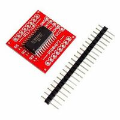

# Electric design
The electric circuits and PCBs have been designed using [KiCad](https://www.kicad-pcb.org/).

But I started using EasyEDA Designer.
EasyEDA is the PCB design tool provided by [LCSC Electronics](https://lcsc.com/).

LCSC offer a full range of services for reasonable prices:  
 1. *LCSC* - [Electronics parts online shop](https://lcsc.com/)  
 1. *EasyEDA* - [A free online PCB design Tool](https://easyeda.com/)  
 1. *JLCPCB* - [PCB manufacturing](https://jlcpcb.com)

The first design, done with EasyEDA, was based on separated PCBs (pilot, copilot,
autopilot). These PCBs were connected together with ribbon cables.
When I was done designing the first prototype, I ordered the PCBs on JLCPCB 
in order to have feedback as soon as possible. I was really satisfied with
the quality of these single layer PCBs but I made mistakes of course.
Some footprints where wrong, like the one for the I2C module PCF8575.
I was also a bit unconfortable with mounting this kind of development board on
my PCB, just because I could solder SMD components.

I was also not saisfied with having my designs and PCBs on EasyEDA not not 
being able to add them to this git repository. I could off course save pictures
and export in JSON format, but that did not satisfy me.

I have therefore decided to use KiCad.
At first sight I though EasyEDA was easier to use then KiCad, but it is
actually the opposite.

I had to add some libraries in order to have all the components I needed.
These libraries are included in this repository as submodules.  
 - [ProMicro](https://github.com/adessein/ProMicroKiCad) provides the ProMicro 
in schematic in `promicro.lib` and the fotprint in `ProMicro.kicad_mod`.
I have forked this repo from [Biacco42](https://github.com/Biacco42/ProMicroKiCad) 
in order to correct some wrong pin names.  
 - [Pretty Kicad Libs by esden](https://github.com/esden/pretty-kicad-libs) provides 
the shift registers 74HC165 and 74HC595 in `pkl_misc.lib`  
 - [ESP32-DEVKITC-32D from snapeda](https://www.snapeda.com/parts/ESP32-DEVKITC-32D/Espressif%20Systems/view-part/) provides the ESP32 dev bord in `ESP32-DEVKITC-32D.lib`  
 - [Alternative KiCad schematic library by alexisv](https://github.com/alexisvl/kicad-schlib) provides the PCF8575 
in `NXP.lib`.

## Symbols, footprints and LCSC references
As explained in this document

|Part    |LCSC  |Footprint                                         |
|--------|------|--------------------------------------------------|
|74HC4051|C5645 |Package_SO:HTSSOP-16-1EP_4.4x5mm_P0.65mm_EP3.4x5mme|
|74HC165 |C5613 |Package_SO:SOIC-16_3.9x9.9mm_P1.27mm              |
|PCF8575 |C12251|Package_SO:SSOP-24_5.3x8.2mm_P0.65mm              |
|74HC595 |C5947 |Package_SO:SOIC-16_3.9x9.9mm_P1.27mm              |
|ULN2803A|C9683 |Package_SO:SOIC-18W_7.5x11.6mm_P1.27mm            |

Others:  
 - RaspberryPi has 28 GPIO connector, I used `Connector_PinHeader_2.54mm:PinHeader_2x14_P2.54mm_Vertical`  
 - ESP32-DEVKITC-32D has the footprint included in `ESP32-DEVKITC-32D.mod`  

## Electronic design 101
In this section, I share some learning on how to use the different parts
(i.e. integrated circuits) and simple design rules.

### LEDs
### Momentary push buttons

### Latching switches
A latching switch is a switch that which position can be switched, but does not feature any restoring force.
These buttons can either that 2 or 3 stable positions. In the real plane, some 3 positions are stable in in two and momentary in one. I have not been able to find such buttons on ebay.

Switches require two input channels. In order to limit the consummations of these switches, the ISR input channels are connected to `+3.3V`. In this position, the switch draws Since the input pin of an ISR only draws `1 uA` max The switch pulls the ISR input to `0V` through a pull-down resistor of `10 kOhms`, resulting in a consumption of `330 uA` per switch in their normal position ().

### Push buttons
Because the state of the push button changes only during a very short period of time, I was concerned that the press event would not be properly detected and the button would not function well. For this reason I have decided not to connect push buttons to ISR, but to use 16-bit I/O expanders for I2C bus PCF8575. With their 3 addressing pins, it is possible to have 8 modules on the same I2C bus (128 extra channels).

### Manage several potentiometers
The solution is to use a 8-channel analog multiplexer 74HC4051. This component connects its Z terminal to one its Y0-Y7 terminals according to the 3-bits address read on its terminal S0-S3 (S3 is the MSB).

### Manage several 7-segments displays
I have used TM1637 modules with 4x 7-seg displays. The solution I have found is to multiplex the data line (DIO) and the clock (CLK). I have used two 74HC4051, but I could have used a double multiplexer.
For 4x TM1637 modules I need to multiplex DIO, CLK, and I need 3 address bits L0-L3. Meaning that I need at 5 IO.
I have decided to use a small Pro Micro to manage TM1637.  

The Pro Micro receives the values to display form the master ESP32 vie I2C.  

