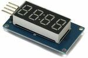

# Electric design
The electric circuits and PCBs have been designed using KiCad. At the beginning 
I used EasyEDA, but I changed for KiCad in order to be able to add the files
to this repository.

## How-to
The cockpit features switches (bi- and tri-states), 
### Momentary push buttons

### Latching switches
A latching switch is a switch that which possiiton can be switched, but does not feature any restoring force.
These buttons can either that 2 or 3 stable positions. In the real plane, some 3 positions are stable in in two and momentaty in one. I have not been able to find such buttons on ebay.

Switches require two input channels. In order to limit the consumtions of these switches, the ISR input channels are connected to `+3.3V`. In this position, the switch draws Since the input pin of an ISR only draws `1 uA` max The switch pulls the ISR input to `0V` through a pull-down resitor of `10 kOhms`, resulting in a consumption of `330 uA` per switch in their normal position ().

### Push buttons
Because the state of the push button changes only during a very short period of time, I was concerned that the press event would not be properly detected and the button would not function well. For this reson I have decided not to connect push buttons to ISR, but to use 16-bit I/O expanders for I2C bus PCF8575. With their 3 addressing pins, it is possible to have 8 modules on the same I2C bus (128 extra channels).

### Manage several potentiometers
The solution is to use a 8-channel analog multiplexer 74HC4051. This component connects its Z terminal to one its Y0-Y7 terminals according to the 3-bits address read on its terminal S0-S3 (S3 is the MSB).

### Manage several 7-segments displays
I have used TM1637 modules with 4x 7-seg displays. The solution I have found is to multiplex the data line (DIO) and the clock (CLK). I have used two 74HC4051, but I could have used a double multiplexer.
For 4x TM1637 modules I need to multiplex DIO, CLK, and I need 3 address bits L0-L3. Meaning that I need at 5 IO.
I have decided to use a small Pro Micro to manage TM1637.  

The Pro Micro receives the values to display form the master ESP32 vie I2C.  

