# Mechanical design

## From flightgear model to the laser cutter / CNC machine
In order to cut my MDF boards into panels of the Cessna Citation X cockpit, I had to follow this procedure:  
 1. Open the AC3 file with Blender  
 2. Export the cockpit into an SVG file  
 3. Fix and refine the drawing using Inkscape  
 4. Export the modules into  DXF files  
 5. Fix and refine the drawings using Cambam  
 6. Prepare the machining  
 7. Generate GCODE  
 8. Cut !

### STEP 1 - Open the AC3 file with Blender
[Blender](https://www.blender.org) is a free and open-source 3D computer graphics software.  

#### Install plugin AC3 in Blender
Import-Export: AC3D (.ac) format  
[Tutorial on Flightgeam.org wiki](http://wiki.flightgear.org/Blender_AC3D_import_and_export)  
[AC3 plugin on Github](https://github.com/majic79/Blender-AC3D/tree/BL2.62)  

### STEP 2 - Export the cockpit into an SVG file
Export to SVG after changing the view point normal to surface  
[How do I align the viewport to a face normal?](https://blender.stackexchange.com/questions/15045/how-do-i-align-the-viewport-to-a-face-normal)  
[Video Youtube](https://www.youtube.com/watch?v=lOii2AZyt2k)  

### STEP 3 - Fix and refine the drawing using Inkscape
#### Redraw the lines and adapt to the actual controls

#### Use engraving font for texts
The texts should be written using [the extension Hershey Text](https://www.evilmadscientist.com/2011/hershey-text-an-inkscape-extension-for-engraving-fonts/) with provide an engraving font.  
To install the extension, I have not installed EggBot as suggested but :
 1. unzipied [eggbot2.7.1_linux.zip](https://github.com/evil-mad/EggBot/releases/download/2.7.1/eggbot2.7.1_linux.zip)  
 2. copied the content of the folder extensions into ~/.config/inkscape/extensions/ (it is OK to keep the structure while extracting and have a folder eggbot in extensions).  
 3. Started Inkscape  
 4. Used Render > Hershey Text  

In the screenshot below (from CamBam), *LH GEN* is written with Hershey Text but *RESET* and *Off* are not.  

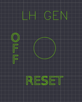

#### Add holes for mounting modules on the front panel
The different panels needs to be attached to the cockpit. I have decided to use M2 screws with a 3 mm head. I leave a clearance area of 1.5x diam around the hole (therefore 3 mm from the centre).

### STEP 4 - Export the modules into DXF files  
### STEP 5 - Fix and refine the drawings using Cambam  
Continuous lines are often split into several Polylines. It is good practice to join them with a tolerance of 0.1 mm in order to obtain just one polyline.

 1. Select all your elements 
 2. Edit>Convert To>Polyline (Ctrl+P)
 3. Edit>Join (Ctrl+J)

Finally,

 1. Select all your elements using the mouse and then look at your Drawing tree and check that all items are selected. 
 2. Delete the the ones that are not selected: they probably are spurious ones that are invisible or overlayed.
 
### STEP 6 - Prepare the machining  
The first time, a CAM style has to be created. Once it has been created, it becomes available for all projects.
#### Create the CAM style LaserDefault
 - Open the System tab
 - Browse the tree, and right-click on System>CAM Styles>Standard-mm
 - Select New CAM style
 - Give it the name LaserDefault
 - Change the following settings:
    - Cutting Depth/Clearance Plane = 0.1
    - Cutting Depth/Depth Increment = 0.1
    - Cutting Depth/Target Depth = -0.1
    - Feedrates/Cut Feedrate = 1000
    - Feedrates/Plunge Feedrate = 1000
    - G-Code Options/Velocity Mode = Exact Stop
    - Tool/Tool Diameter = 0.15

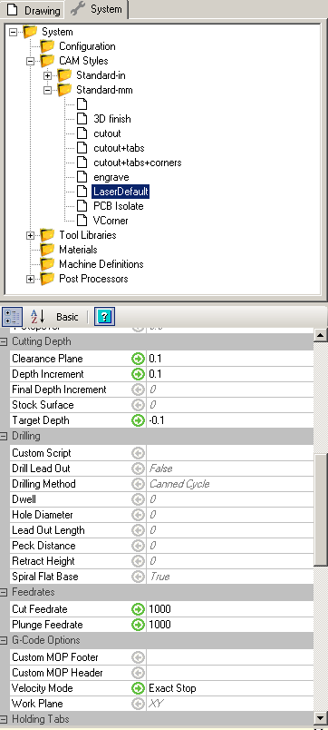

#### Activating the style LaserDefault
Right click on *Machining* and set Style = LaserDefault.  
Creating the style is done once for all, but activating the style should be done for each project.  

#### Define the machining operations
Different machining operations need to be created.
The machining operations can be of two different types:  

 - **Engraving** is used for text and decoration. The tool (laser) follows the path.
 - **Profiling** is used to cut out shapes (pockets and outside profile). The diameter of the tool is taken into account, meaning that the tool is positioned half-diameter inside or outside the path.

On the picture below, COM1 and COM2 texts are engraved, while the holes for the button are profiled (see the dark green circle slightly smaller inside the light one: it is the path the laser will follow).

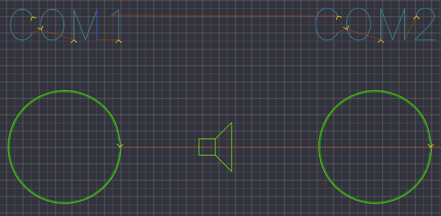

##### Engraving
 1. Select all the text and decoration (do not worry, if you forget any, you will be able to add them later).
 2. Right click on selection>Machining>Engrave. A new part and a new Engrave job has been created in the Drawing tab *(note: check that is it no needed to create a part by right-clicking on Machining>New part)*
 3. Select the engraving operation and change the following settings:
    - Feedrates/Cut Feedrate = 1500
    - Tool/Tool Diameter = 0
 4. You can now right-click on the engraving operation and select Generate toolpaths. You will be able to perform this action again, and at the part level in order to generate the toolpaths for all your machining operations at once.
 5. As mentioned in the first step, if you want to add more objects to the engraving operation, right-click on the operation and click on *Select drawing objects*. As instructed, select the objects and press enter. After that, you should re-generate the toolpaths.

##### Profiling
The steps to follow for profiling are the same except few important differences:  

 1. Select all the **pockets**  
 2. Right click>Machining>Profile. A new part and a new Profile job has been created in the Drawing tab  
 3. Change the following settings:  
    - (General)/Inside/Outside = **Inside**  
    - Feedrates/Cut Feedrate = 400  
    - G-Code Options/Velocity Mode = Constant Velocity  
 4. Select the **outer bounds**  
 5. Right click>Machining>Profile. A new part and a new Profile job has been created in the Drawing tab  
 6. Change the following settings:  
    - (General)/Inside/Outside = **Outside**  
    - Feedrates/Cut Feedrate = 400  
    - G-Code Options/Velocity Mode = Constant Velocity  

The constant velocity mode is used for this project because the circles are defined as Polylines (due to the conversion SVG/DXF/CB), meaning a series of breakpoints. The constant velocity mode soften the movement of the tool and reduces vibrations by preventing the tool making small stops at every breakpoint.

  
##### Important rules
 * One module = 1 part. It is a good practice to separate the different parts to be cut (for this project, the modules) into different parts in order to make pause between parts.  
 * Generate one GCODE per module, for the same reason.
 * Cut in the order :  
    1. Test and decorations  
    2. Pockets (inside cuts)  
    3. Outer bounds  

##### Useful tips
As you will have to create engraving and profiling operations for every part you have, use the *copy* and *paste format* commands to change the parameters quickly.  
Create a new part, a new machining operation and copy/paste the settings from another part. 

### STEP 7 - Generate GCODE  
 1. Click on each part, and select *Produce gcode*.  
 2. Save the file  

### STEP 8 - Cut !
### Result
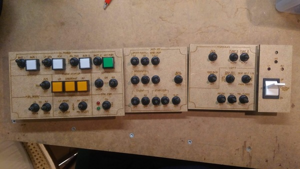

## Panel dimensions
I have measured using Inkscape : the dimention of the front panel appers to be approximately 1403x452  mm.  
At the hardware shop, I could buy MDF panels of 1200x800x3 mm (5€ piece).  
At my hacker space, a member has made a C02 laser cutter machine. It can panels no larger than 750x750 mm.  
I have therefore decided to split the front pamel into 2 and attach them.  

The control console (with all the buttons) comes forward with an angle of 45 deg, over 8 cm (it is 118 mm high).

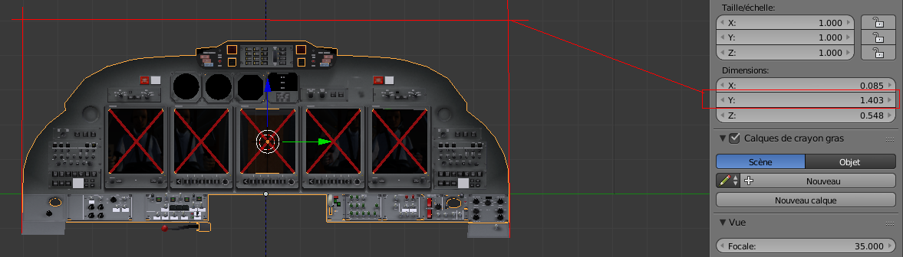

## List of used controls
Original buttons and controls are almost impossible to find, and if they are they cost a fortune (check out [simparts.de](https://www.simparts.de/en/homecockpit/general-aviation-en.html) as an example). I have therefor decided to buy cheap, to buy on eBay. I spent some time trying to find the best matches, but has do make compromises. In this section I present the controls that I have bought and their purpose. 

What | Photo | Link | Used for | Notes
---- | ----- | ---- | -------- | -----
Square push buttons|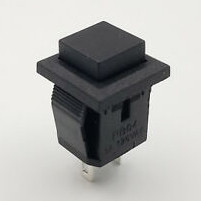|[Black 14 X 14mm Square 2Pin Momentary 1NO SPST Mini Push Button Switch](https://www.ebay.com/itm/153318952686)| EICAS buttons, radio buttons, PFD/MFD configuration panels pilot and copilot sides)|The vendor claims 14x14mm but I made a cutout of 13x11mm to make sure they do not move.
7-segments displays|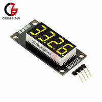|[0.36" 7 Segment Display Tube 4-Bit LED TM1637 Module Red/Green/Blue/Yellow/White](https://www.ebay.com/itm/163018693389)|Engine speeds|The [7-segment block measures 30x14 mm](https://detail.1688.com/offer/558905007007.html) but [the size of the board is 40x24 mm](https://components101.com/displays/tm1637-grove-4-digit-display-module). Because of this constrain I had to increase the spacing between the displays.  
Mini-joystick button|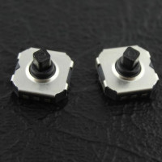|[5 Way Momentary Push Button SMD SMT Mini Tactile Switch Thumb Joystick](https://www.ebay.com/itm/264112757766)
Slide potentiometer|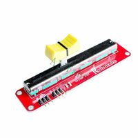|[10K Linear Slide Potentiometer Module Dual Output Arduino AVR Electronic Block](https://www.ebay.com/itm/232387110303)|Flaps control|Continuous, no notches: will have to make some my self. No motor, otherwise it is too expensive.
Rotary encoder|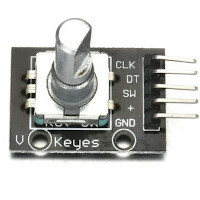|[KY-040 Rotary Encoder Module for Arduino AVR PIC NEW XJ](https://www.ebay.com/itm/183406488017)|CRS, HDG, any rotary that can be turned indefinitely|I2C
Toggle button|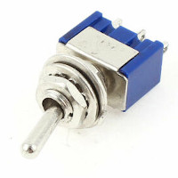|[15x 3 Pin 3 Position ON-OFF-ON SPDT Mini Latching Toggle Switch AC 125V/6A FU](https://www.ebay.com/itm/312536579444)|So many :)|
Square latching button + LED|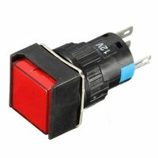|[16mm Square Latching Push Button Switch Self-reset LED Light 5-Pins](https://www.ebay.com/itm/142971213806)|Master warning/caution + Engine start|Different colours needed

