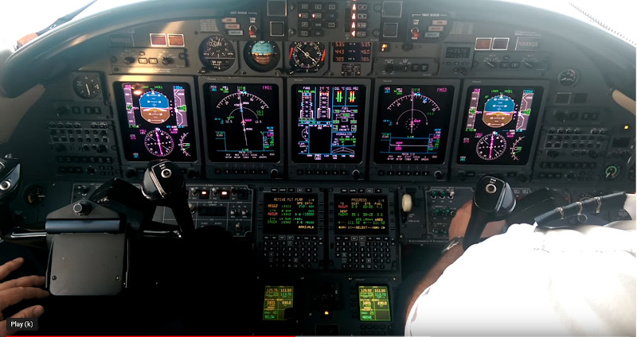
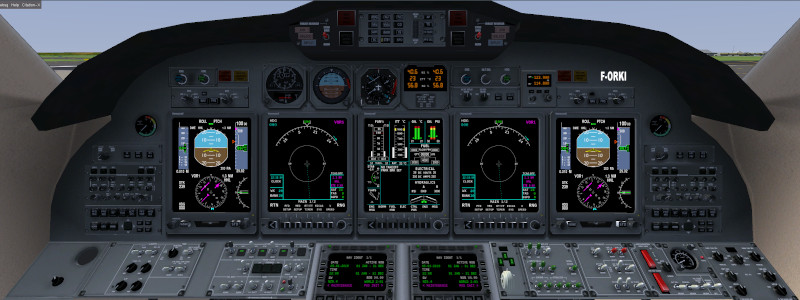
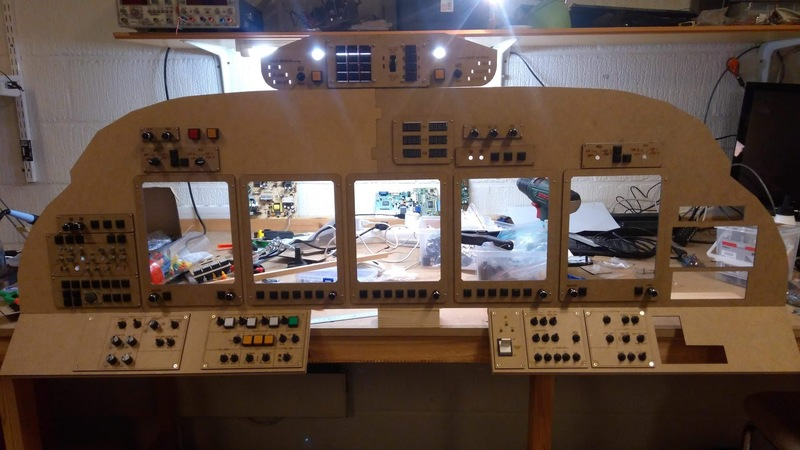

# Presentation

The purpose of this project is to build a 1:1 home cockpit for flying the Cessna Citation X aircraft in Flightgear.  
Flightgear is an open-source software that you can download on [flightgear.org](http://home.flightgear.org).  

The Citation X that I use is the outstanding version developped by the PAF team (Patrouille de France).  
 - forum equipe-flightgear (in french) : [equipe-flightgear.forumactif.com](http://equipe-flightgear.forumactif.com/)  
 - repository pafteam on [sourceforge.net](https://sourceforge.net/projects/pafteam/)  

Below are  
 - a screenshot from a [Youtube video](https://youtu.be/rzMN0wDuVSo?t=93) showing the cockpit.  
 - a screenshot from flightgear showing the cockpit  
 - a picture of my cockpit on 7th December 2019  

  
  


My project covers :  
 - the drawings used for cutting the MDF sheets and build the cockpit,  
 - the circuit diagrams and PCBs,  
 - the code used in the microcontrollers (ESP-32 and Arduino Leonardo/Pro Micro) for the inputs and outputs,  
 - the code used in the Raspberry Pi Zero W for displaying the canvas on the screen.  
 
The KiCad projects for the 3 PCBs (mainboard, APU and Pedestral) are available.

# How to clone the repository

This repository includes Kicad libraries as git sub-modules.
Therefore, you should get the modules after cloning the repo.

```
git clone git@github.com:adessein/citationx-cockpit.git
cd citationx-cockpit
git submodule update --init --recursive
```

# Documentation

I have documented this project so you can find details about how I designed my home cockpit.
My intention is to share my experience, explain my choices and show where I failed.  

I hope that it will help you understanding the content of this repository, help you in your projects (home cockpit or others).

[Mechanical design](Documentation/Mechanical-design.md) - How I build the cockpit from the 3D model  
[Electric design](Documentation/Electric-design.md) - How I designed the electronics  
[EFIS](Documentation/EFIS.md) - How I rendered the different screens of the EFIS (PFD, ND, EICAS)  

